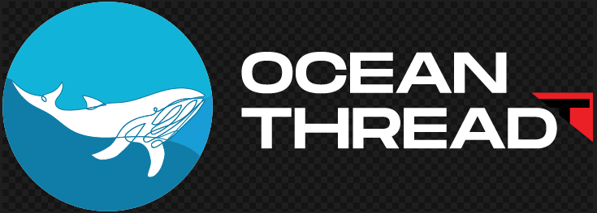

# OCEAN TRHEAD

Proyecto desarrollado para el hackaton Hack the Ocean de LaunchX 2022.

# Integrantes del equipo

| Integrante | Correo de LaunchX | Perfil de GitHub |
| :-------------: |:-------------:| :-----:|
|`Ricardo Aldahir Corona`|launchx07686@innovaccion.mx||
|`José Manuel Estrada`|launchx07221@innovaccion.mx||
|`Ramón Alejandro Gutiérrez`|launchx03961@innovaccion.mx||
|`Luis Eduardo Martínez [Líder]`|launchx04928@innovaccion.mx||
|`Pedro Damián Reyes`|launchx07001@innovaccion.mx||

# Planteamiento del problema

En las últimas décadas, los esfuerzos por combatir la pesca ilegal, no reportada y no regulada, han dado pie al desarrollo de iniciativas para mejorar la transparencia en la industria alimentaria de productos del mar, a través de acuerdos internacionales, regulaciones gubernamentales nacionales, e iniciativas privadas voluntarias.

El objetivo de estas iniciativas de transparencia es asegurar la sustentabilidad en las cadenas de suministro. Con nuestra propuesta se pretende aportar nuestro grano de arena a que esto sea posible, por medio del uso de recursos tecnológicos llevar un registro transparente y una certificación de que el recurso marítimo obtenido por nuestros afiliados es de procedencia completamente legal y sustentable.

### Referencias para conocer más del tema

| Referencia | Link|
| :-------------: |:-------------:|
|Global risks of labor abuse and illegal, unreported, and unregulated fishing||
|Combatting illegal fishing through transparency initiatives||

# Propuesta

Ocean Thdread es una campaña que busca reducir los desechos plásticos del océano, nuestra prioridad son desperdicios de redes y equipo de pesca. A su vez, aportando a las iniciativas que buscan transparencia y trazabilidad de productos alimenticios provenientes del mar.

El plan de acción se conforma por 4 etapas:

### 1- Track voluntario

Para reducir el desperdicio hay que saber cuantas redes se usan y cuántas quedan en el océano. Para esto buscamos la cooperación de proveedores de material pesquero para generar un registro de ventas.

Implementamos un sistema de registro y administración de embarcaciones, utilizamos códigos QR para llevar un fácil registro de ventas.

Es necesario que la industria pesquera se sume de forma voluntaria a esta iniciativa para tener un inventario de los materiales de pesca. Por un lado, la campaña estará sonando buscando la cooperación social en busca de consumir menos alimentos que no contengan el logo de OCEAN THREAD, así incentivamos a las empresas pesqueras a sumarse de manera voluntaria a la campaña, como extra ofrecemos una white list e incentivos.

Esto es un prototipo que debe cumplir con las especificaciones de modularidad y escalabilidad. Este primer paso será una prueba y se mejorará el sistema con base a los resultados.

### 2- Track Normativo

Trabajar de la mano con instituciones reguladoras de la pesca y gobierno para establecer el sistema de track e inventario de manera normativa. Implementando el prototipo desarrollado en el track voluntario.

### 3- Reciclaje

Una vez que tengamos la información y que podamos reducir el desperdicio en tiempo real, la idea es colaborar con otros proyectos de reciclaje para recolectar y usar el plástico de los océanos para la fabricación de nuevas redes y material de pesca.

### 4 - Innovación

Uno de los mayores problemas es la localización de las redes, si se llegan a romper y quedan atoradas en alguna corriente, ¿cómo podemos localizarlas?. La idea es experimentar con nuevas formas de geolocalización, algo que no afecte a la vida marina y que pueda ser puesto dentro de las redes. 